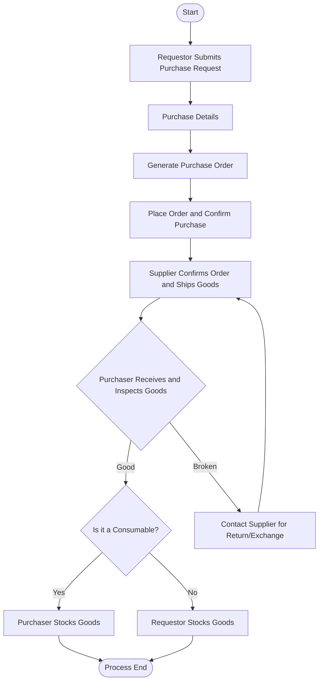

# Flowchart

## Procurement Process

```mermaid

graph TD
    st([Start]) --> add_request[Requestor Submits Purchase Request]
    add_request --> purchase_item[Purchase Details]
    purchase_item --> add_purchase_order[Generate Purchase Order]
    add_purchase_order --> create_PO[Place Order and Confirm Purchase]
    create_PO --> supplier_confirm[Supplier Confirms Order and Ships Goods]
    supplier_confirm --> receive_check{Purchaser Receives and Inspects Goods}
    receive_check -->|Good| good_category{Is it a Consumable?}
    receive_check -->|Broken| good_exchange[Contact Supplier for Return/Exchange] --> supplier_confirm
    good_category -->|Yes| buyer_gr[Purchaser Stocks Goods] --> process_end([Process End])
    good_category -->|No| user_gr[Requestor Stocks Goods] --> process_end([Process End])


```