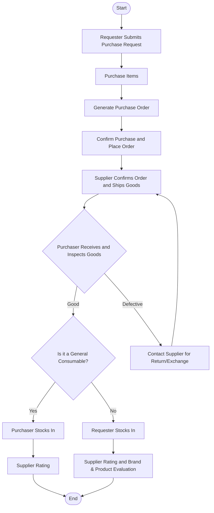

# Flowchart

## Procurement Process

```mermaid

graph TD
    st([Start]) --> req_submit[Requester Submits Purchase Request]
    req_submit --> purchase_info[Purchase Items]
    purchase_info --> gen_PO[Generate Purchase Order]
    gen_PO --> confirm_order[Confirm Purchase and Place Order]
    confirm_order --> supplier_confirm[Supplier Confirms Order and Ships Goods]
    supplier_confirm --> receive_inspect{Purchaser Receives and Inspects Goods}
    receive_inspect -->|Good| item_category{Is it a General Consumable?}
    receive_inspect -->|Defective| item_return[Contact Supplier for Return/Exchange] --> supplier_confirm
    item_category -->|Yes| stock_cons[Purchaser Stocks In] --> Rating[Supplier Rating]
    Rating --> process_end([End of Process])
    item_category -->|No| stock_noncons[Requester Stocks In] --> Evaluation[Supplier Rating and Brand & Product Evaluation]
    Evaluation --> process_end([End])

```